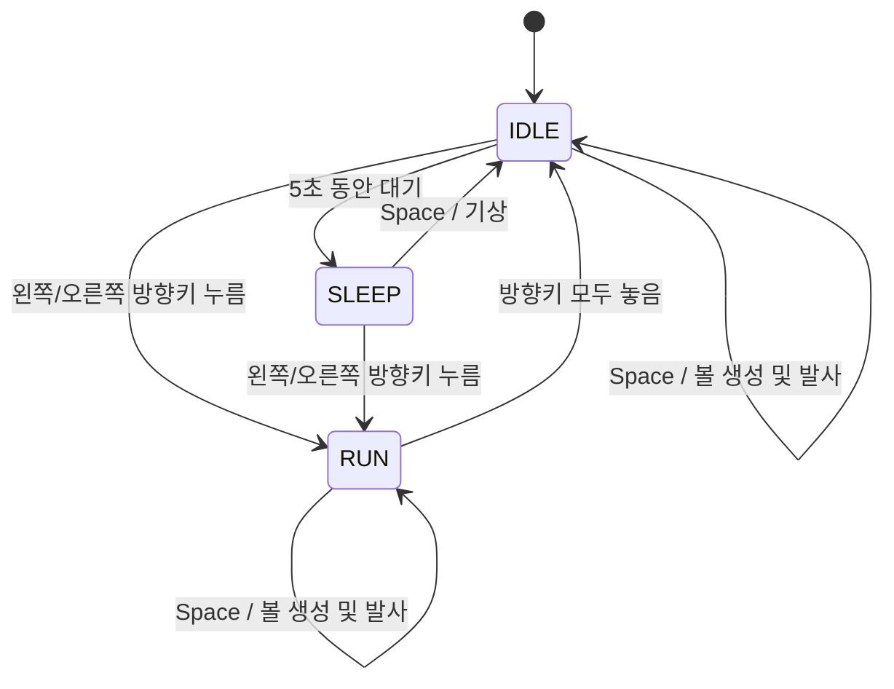

# 소년 캐릭터 상태 다이어그램

```mermaid
stateDiagram-v2
    [*] --> IDLE
    IDLE --> RUN: 왼쪽/오른쪽 방향키 누름
    RUN --> IDLE: 방향키 모두 놓음
    IDLE --> SLEEP: 5초 동안 대기
    SLEEP --> IDLE: Space / 기상
    SLEEP --> RUN: 왼쪽/오른쪽 방향키 누름
    IDLE --> IDLE: Space / 볼 생성 및 발사
    RUN --> RUN: Space / 볼 생성 및 발사
```

발사 시 `Ball` 객체를 `game_world`에 추가합니다. `face_dir`이 1이면 오른쪽, -1이면 왼쪽으로 이동하며 화면 밖으로 나가면 제거됩니다. 방향 메시지는 1.5초 뒤 사라집니다. Sleep 상태에서 Space는 기상에만 사용됩니다.
